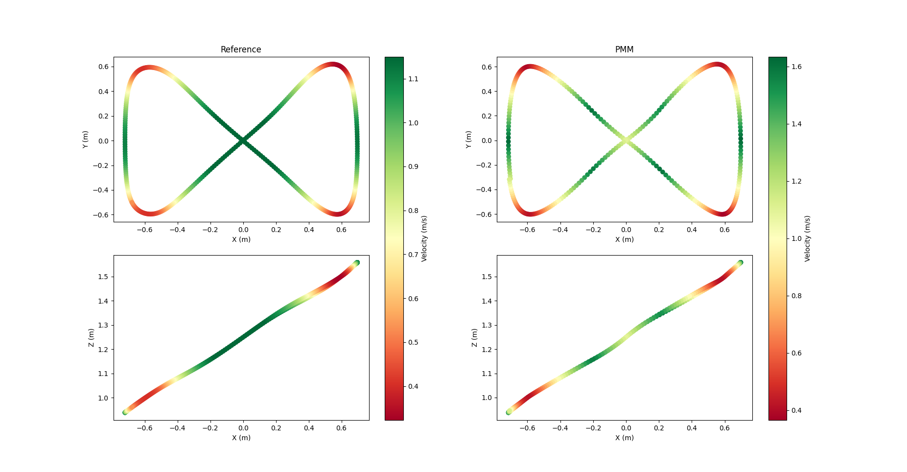
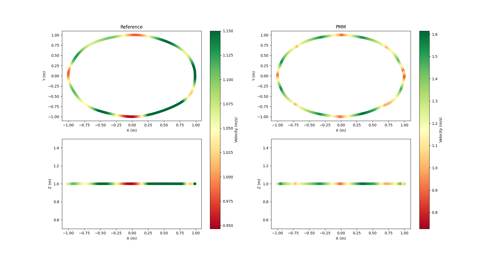

# Data records crazyflie experiments

## Overview

This dataset contains trajectory data collected from a drone during two experiments (circle and eigh-shaped circuits). The dataset provides information about the flights, including spatial coordinates, linear velocity and linear acceleration. These trajectories were recorded with the mocap libraries and the Optitrack system.

## Content
The dataset includes the following files:

- **pmm_1_lap.csv**: Point Mass Model trajectory generated by our proposed algorithm.
- **ours_1_lap.csv**: CSV file containing the polynomial approximation trajectory to track.
- **state_1_lap.csv**: Recorded flight performed by the crazyflie.

## Data Format
The data is provided in a CSV format with the following columns:

- **Timestamp**: Timestamp of the recorded data, or the time of the trajectory planned.
- **Position (x,y,z)**: Tracking position or reference position.
- **Velocity (x,y,z)**: Linear velocity of the drone.
- **Acceleration (x,y,z)**: Linear acceleration of the drone.

## Eigh-shaped Circuit (Polynomial vs PMM)

## Circle Circuit (Polynomial vs PMM)

## [**Video**](docs/video/VideoExperiments.mp4)